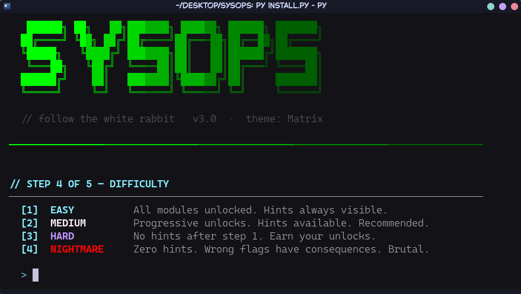

<div align="center">

# SYSOPS

**A terminal-based sysadmin & cybersecurity training game.**
Type real Linux commands in a simulated REPL, complete missions, and level up — nothing ever touches your actual system.


</div>

```
   ██████████  ██      ██  ██████████    ██████    ████████    ██████████
   ██          ██      ██  ██          ██      ██  ██      ██  ██
   ██████████    ██████    ██████████  ██      ██  ████████    ██████████
           ██      ██              ██  ██      ██  ██                  ██
   ██████████      ██      ██████████    ██████    ██          ██████████

   // terminal command simulator
```

---

## What is this?

SYSOPS is a **single-player, terminal-native game** that teaches the command-line tools real
sysadmins and security engineers use every day — `rsync`, `docker`, `nmap`, `ssh`, `git`,
`tailscale`, and dozens more. You play in a fully **simulated** shell: every command produces
realistic output, but **nothing is executed on your real machine and no real network traffic is
ever sent**. It's a safe sandbox to build muscle memory.

Guided **missions** walk you through real workflows ("move an 850 MB file over Tailscale with the
optimal `rsync` flags", "stand up an nginx reverse proxy", "run a full recon sweep"). You earn XP,
climb 10 levels, unlock modules, and collect achievements as you go.

> ⚠️ **Educational simulation only.** The red-team commands (`nmap`, `hydra`, `sqlmap`, `msfvenom`,
> etc.) are **fictional reproductions** for learning concepts and syntax. They do not scan, attack,
> or connect to anything. Use the real tools only on systems you are authorized to test.

## Screenshots

<p align="center">
  
</p>

## Features

- 🎮 **28 missions** across 4 difficulty tiers (Easy → Nightmare), plus quick single-command drills
- ✅ **Real command verification** — a mission step only completes when you actually run the right
  command, so you can't fake your way through
- ⌨️ **Feels like a real terminal** — arrow-key history, **Tab completion** (commands, mission IDs,
  file paths), and `cd`/`ls`/`pwd` filesystem navigation
- 📈 **Progression** — XP, 10 levels with titles, focus modules, achievements, and persistent saves
- 🎨 **Customizable** — swappable colour themes and ASCII banner fonts, live-switchable in-game
- 📦 **Zero dependencies** — pure Python standard library, no `pip install` required

## Quick start

Requires **Python 3.8+**. No installation or dependencies needed.

```bash
# Clone and run straight from the source
git clone https://github.com/heian-sukuna/sysops.git
cd sysops
python3 -m sysops
```

### Optional: install a launcher

To run `sysops` from anywhere:

```bash
python3 install.py    # writes a launcher to ~/.local/bin
sysops
```

## How to play

When you start, pick a theme, identity, difficulty, and a **focus module**. Then you're dropped
into the shell. Some commands to get going:

| Command            | What it does                                        |
| ------------------ | --------------------------------------------------- |
| `help`             | List every available command                        |
| `help <module>`    | Deep-dive cheatsheet (`help rsync`, `help git`, …)  |
| `missions`         | List missions for your current focus                |
| `missions all`     | List every mission                                  |
| `mission <id>`     | Start a mission (e.g. `mission ts01`)               |
| `status`           | Show progress on the active mission                 |
| `challenge`        | A quick single-command drill                        |
| `xp`               | Your XP, level, and stats                           |
| `theme` / `font`   | Restyle the UI live                                 |
| `achievements`     | Badges you've earned                                |
| `save` / `quit`    | Save progress (also auto-saves)                     |

**Pro tips:** press `↑`/`↓` to recall history, hit `Tab` to auto-complete, and use `cd`, `ls`,
and `pwd` to move around the simulated filesystem.

## Command coverage

| Module                | Tools simulated                                                                 |
| --------------------- | ------------------------------------------------------------------------------- |
| **Transfer**          | `ssh`, `ssh-keygen`, `ssh-copy-id`, `rsync`, `tailscale`, `ping`                |
| **Containers & web**  | `docker`, `docker compose`, `nginx`                                             |
| **Networking**        | `netstat`, `ss`, `ip`, `ifconfig`, `dig`, `traceroute`, `curl`, `nload`, `iftop`|
| **Security**          | `nmap`, `tshark`, `gobuster`, `nikto`, `hydra`, `hashcat`, `ufw`, `fail2ban`, `lynis`, `shodan` |
| **Git**               | full subcommand coverage — `branch`, `merge`, `rebase -i`, `stash`, `bisect`, … |
| **Red team** *(sim)*  | `theHarvester`, `amass`, `searchsploit`, `msfvenom`, `msfconsole`, `sqlmap`, `linpeas`, … |
| **System & files**    | `ls`, `cd`, `pwd`, `cat`, `mkdir`, `cp`, `mv`, `df`, `free`, `top`, `ps`, …      |

## Project structure

```
sysops/
├── __main__.py            Entry point — wires everything together
├── core/
│   ├── repl.py            Main input loop & command dispatch
│   ├── world.py           All simulated state (network, fs, docker, scans…)
│   ├── save.py            Persistent saves, XP/level logic (~/.sysops/save.json)
│   ├── ui.py              ANSI engine — colours, boxes, themes, banners
│   └── menu.py            Main menu, new-game wizard, options
├── modules/               One file per tool family (transfer, containers, …)
└── scenarios/
    ├── missions.py        Mission & quick-challenge definitions
    ├── checks.py          Command-verification predicates for mission steps
    └── engine.py          Mission runner & progress tracking
tests/                     unittest suite
```

The architecture is one-directional: **REPL → Modules → World/Save**. See
[`CLAUDE.md`](CLAUDE.md) for the full data contracts.

## Development

Run the test suite (pure stdlib `unittest`, no dependencies):

```bash
python3 -m unittest discover -s tests -v
```

### Adding a mission

Add a dict to `SCENARIOS` in `scenarios/missions.py`. Each step is
`(description, check_fn, hint)`. **Don't use `lambda w, s: True`** — verify the player actually ran
the command with the helpers in `scenarios/checks.py`:

```python
from scenarios.checks import ran, ran_any, ran_re

{
    "id": "demo01",
    "title": "Hello Docker",
    "category": "docker",
    "difficulty": 1,
    "tags": ["DOCKER", "EASY"],
    "story": "Pull and inspect an image.",
    "steps": [
        ("Pull the nginx image", lambda w, s: "nginx" in w.docker_images, "docker pull nginx"),
        ("Inspect it",           ran("docker", "inspect"),                "docker inspect nginx"),
    ],
    "xp_reward": 40,
}
```

### Adding a command

1. Add a method to the relevant file in `modules/` that mutates `self.w` (the `VirtualWorld`).
2. Wire the command name to it in `GameREPL._dispatch()` (`core/repl.py`).
3. Add a help entry in `GameREPL._full_help()` and to the completion list (`COMMANDS`).

## Save data

Progress lives in `~/.sysops/save.json` (with `history` and `session.log` alongside). Delete that
directory to start completely fresh.

## License

[MIT](LICENSE) © 2026 heian-sukuna
